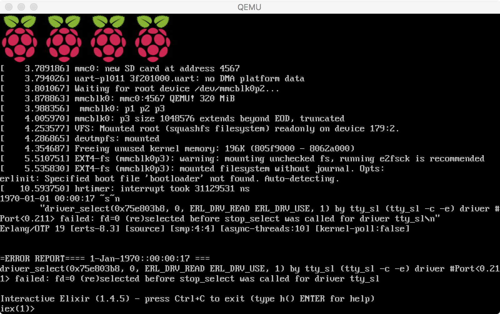

# Raspberry Pi 2 Model B
[](https://circleci.com/gh/nerves-project/nerves_system_rpi2)

This is the base Nerves System configuration for the Raspberry Pi 2 Model B.


<br><sup>[Image credit](#fritzing): This image is from the [Fritzing](http://fritzing.org/home/) parts library.</sup>

| Feature              | Description                     |
| -------------------- | ------------------------------- |
| CPU                  | 900 MHz quad-core ARM Cortex-A7 |
| Memory               | 1 GB DRAM                       |
| Storage              | MicroSD                         |
| Linux kernel         | 4.4.50 w/ Raspberry Pi patches  |
| IEx terminal         | HDMI and USB keyboard (can be changed to UART)   |
| GPIO, I2C, SPI       | Yes - Elixir ALE                |
| ADC                  | No                              |
| PWM                  | Yes, but no Elixir support      |
| UART                 | 1 available - ttyAMA0           |
| Camera               | Yes - via rpi-userland          |
| Ethernet             | Yes                             |
| WiFi                 | Requires USB WiFi dongle        |
| Bluetooth            | Not supported                   |

## Supported USB WiFi devices

The base image includes drivers and firmware for Ralink RT53xx
(`rt2800usb` driver), RealTek RTL8712U (`r8712u` driver) and
RealTek RTL 8192 (`rtl8192cu` driver) devices (e.g. EDImax USB WiFi dongles).

We are still working out which subset of all possible WiFi dongles to
support in our images. At some point, we may have the option to support
all dongles and selectively install modules at packaging time, but until
then, these drivers and their associated firmware blobs add significantly
to Nerves release images.

If you are unsure what driver your WiFi dongle requires, run Raspbian and configure WiFi
for your device. At a shell prompt, run `lsmod` to see which drivers are loaded.
Running `dmesg` may also give a clue. When using `dmesg`, reinsert the USB
dongle to generate new log messages if you don't see them.

## Installation

If [available in Hex](https://hex.pm/docs/publish), the package can be installed as:

  1. Add nerves_system_rpi2 to your list of dependencies in `mix.exs`:

        def deps do
          [{:nerves_system_rpi2, "~> 0.11.0"}]
        end

  2. Ensure nerves_system_rpi2 is started before your application:

        def application do
          [applications: [:nerves_system_rpi2]]
        end

## Running on QEMU [WIP]



If you want to try your app using QEMU:

1. Navigate to your nerves project directory.
2. Follow [these](https://hexdocs.pm/nerves/faq.html#using-a-usb-serial-console) instructions to make `erlinit` launch the shell in your terminal. You should enable `-c ttyAMA0` instead of  `-c tty1` in `erlinit.config`.

3. Using `fwup`, create an image file from a .fw file for use with `dd`:

  ```bash
  mkdir -p _build/rpi2/dev/nerves/images/qemu

  fwup -a \
    -d _build/rpi2/dev/nerves/images/qemu/${PWD##*/}.img \
    -i _build/rpi2/dev/nerves/images/${PWD##*/}.fw \
    -t complete
  ```

4. Using `unzip`, extract the kernel image, cmdline.txt and the .dtb from the .fw file:

  ```bash
  unzip _build/rpi2/dev/nerves/images/${PWD##*/}.fw \
    data/cmdline.txt data/zImage data/bcm2709-rpi-2-b.dtb \
    -d _build/rpi2/dev/nerves/images/qemu
  ```
5. Execute QEMU:
  ```bash
  qemu-system-arm -M raspi2 -cpu arm1176 -smp 4 -m 512 \
    -kernel _build/rpi2/dev/nerves/images/qemu/data/zImage \
    -dtb _build/rpi2/dev/nerves/images/qemu/data/bcm2709-rpi-2-b.dtb \
    -drive file=_build/rpi2/dev/nerves/images/qemu/${PWD##*/}.img,if=sd,format=raw \
    -append "`cat _build/rpi2/dev/nerves/images/qemu/data/cmdline.txt`" \
    -serial mon:stdio \
    -net none
  ```

Notes:
  - Tested using version 2.9.0 of QEMU.
  - Keyboard support is still missing; in the meantime, you have to modify your config.exs to make erlinit launch the shell in your terminal. Optionally, you may use the `-nographic` option of QEMU, but you'll have to use `kill -9` to manually kill the process instead of just closing the QEMU window.
